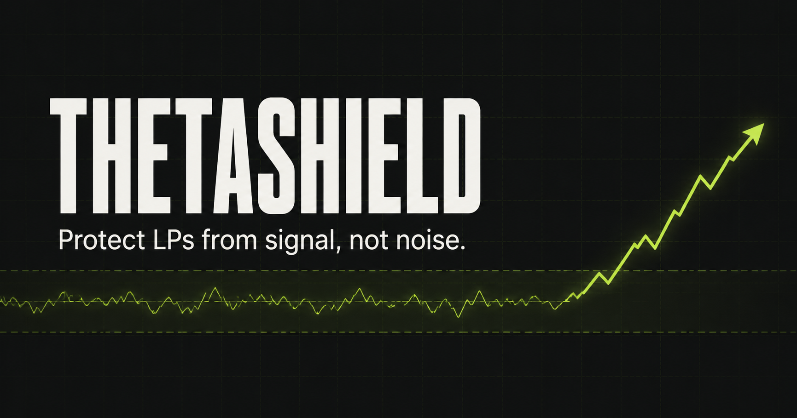
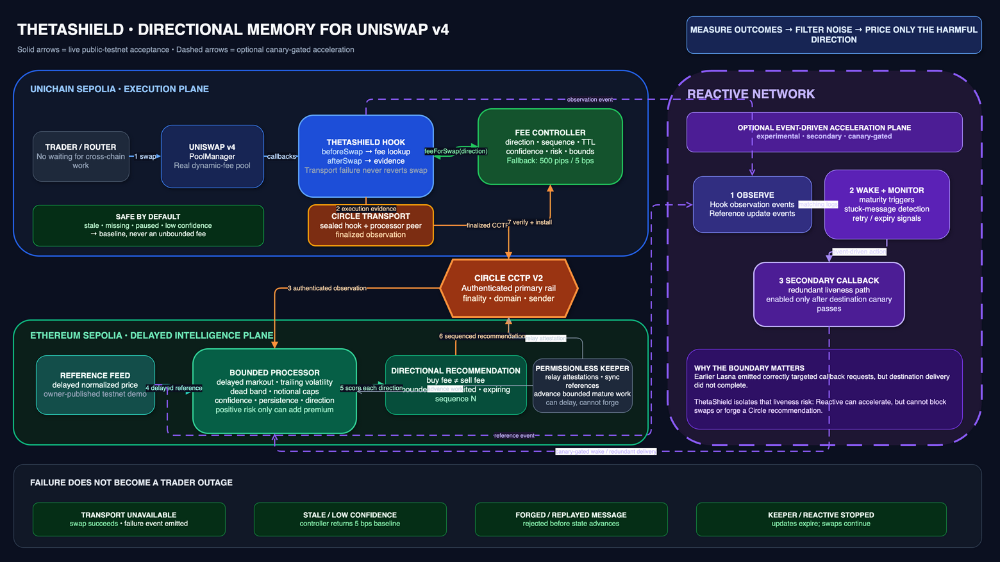

# ThetaShield

<p align="center">
  
</p>

<p align="center">
  <strong>Directional memory for Uniswap v4.</strong><br />
  Delayed outcome evidence becomes a bounded, direction-specific fee recommendation—ordinary volatility does not.
</p>

<p align="center">
  
  
  
  
  
</p>

<p align="center">
  <a href="https://theta-shield.vercel.app/#live-proof"><strong>Live testnet proof</strong></a>
  ·
  <a href="docs/THETASHIELD_ARCHITECTURE.png">Architecture</a>
  ·
  <a href="docs/PHASE8D_HANDOFF.md">Acceptance trace</a>
  ·
  <a href="docs/WINNING_PITCH_SCRIPT.md">Four-minute pitch</a>
</p>

> [!IMPORTANT]
> ThetaShield is unaudited research software deployed only on public testnets. The historical Phase 8D proof uses an owner-published demo feed; the `RESEARCH_V1` release path uses a permissionless, liquidity-filtered three-pool sampler. Neither is a production oracle. The risk metric is a controlled adverse-selection proxy—not exact LVR, individual LP loss, or a profitability claim. The hook has **not** been submitted.

## The problem

Liquidity providers do not need a higher fee every time a market becomes noisy. They need protection when flow repeatedly moves against the pool after execution.

Most adaptive-fee designs react to unsigned volatility. That can make ordinary two-sided movement expensive while missing the distinction that matters: **which swap direction is consistently followed by an adverse price move?**

ThetaShield introduces delayed directional memory:

- it measures what happened *after* a swap;
- preserves the sign of the outcome;
- filters movement already explained by trailing noise;
- requires persistent evidence across bounded epochs; and
- raises only the fee direction supported by sustained adverse selection.

When evidence is missing, stale, paused, or low-confidence, the system returns to the configured baseline.

## How ThetaShield works

1. **Execute on Unichain.** A real Uniswap v4 hook reads the current directional fee, applies it to the swap, and emits compact execution evidence.
2. **Send finalized evidence.** The origin transport sends the observation through Circle CCTP V2. Transport failure never reverts the trader's completed swap.
3. **Wait for the outcome.** A bounded processor on Ethereum Sepolia waits for delayed, liquidity-filtered evidence from three configured v4 pools instead of pretending future information exists at execution time.
4. **Filter and persist.** The processor computes signed markout against strictly trailing volatility, applies confidence and notional bounds, and tests an `n-of-k` persistence window.
5. **Return a recommendation.** Circle carries a sequenced, expiring directional recommendation back to the origin controller.
6. **Verify before use.** The controller authenticates the Circle transmitter, domain, sealed peer, sequence, time window, confidence, fee, and risk bounds before exposing the fee to the hook.

The core signal is deliberately simple:

```text
signed markout   m = direction × (reference price − execution price) / execution price
filtered signal  e = sign(m) × max(|m| − k × trailing volatility, 0)
activation       = toxic epochs ≥ n of K
```

The current sample is excluded from its own volatility band. A trade therefore cannot make itself look harmless by widening the threshold used to score it.

## Architecture

<p align="center">
  <a href="docs/THETASHIELD_ARCHITECTURE.png">
    
  </a>
</p>

The latency-sensitive execution plane stays on Unichain Sepolia. Delayed statistical work runs on Ethereum Sepolia. Circle CCTP V2 is the authenticated primary transport; Reactive Legacy Lasna schedules bounded processor work, while permissionless keepers retain independent relay and automation recovery paths. Neither receives authority to forge messages or recommendations.

| Component | Responsibility |
|---|---|
| `ThetaShieldHook` | Selects the directional fee, records the swap observation, and fails open only for observation transport availability. |
| `ThetaShieldCircleTransport` | Accepts observations from the sealed hook and sends finalized Circle messages to the sealed processor peer. |
| `ThetaShieldCircleProcessor` | Owns bounded queues, delayed references, trailing volatility, confidence, persistence, and directional fee calculation. |
| `PoolMedianReferenceSampler` | Permissionlessly normalizes three liquidity-qualified v4 pools into distinct sources for robust median and dispersion scoring. |
| `ThetaShieldController` | Verifies returned Circle messages and exposes a safe fee to the hook. Missing or invalid state resolves to baseline. |
| `ThetaShieldAutomationRSC` | Watches queued observations and CRON, schedules maturity/finalization wake-ups, and caps retries on Reactive Network. |
| `ThetaShieldAutomationExecutor` | Authenticates the RVM callback and executes one bounded sample/sync/process cycle; independent keepers can invoke the same safe cycle. |
| Permissionless keeper | Relays Circle attestations and provides automation redundancy without becoming a trust root. |

### Reactive Network: automation and resilience plane

Reactive Network Legacy Lasna provides ThetaShield's event-driven maturity scheduler and liveness guardian. Ethereum processor events arm work, the official Legacy `Cron10` signal wakes it only after maturity, and an authenticated callback through the official Ethereum Sepolia proxy runs the bounded three-source sampling and processing cycle. Failed or incomplete cycles enter a capped retry path.

Its authority is deliberately narrow: Reactive cannot forge a Circle observation, calculate an independent recommendation, install controller state, or block a swap. Independent keepers can call the same executor, so a Reactive outage degrades automation while Circle authentication, expiry, and baseline fallback preserve fee safety. The former Omni design that duplicated processing and attempted a direct chain-1301 callback remains historical failure evidence; the live G10 release uses the supported Legacy path and calls the Ethereum processor executor instead.

## Live testnet deployment

The G10 `RESEARCH_V1` lifecycle is live across Unichain Sepolia, Ethereum
Sepolia, and Reactive Legacy Lasna. A real swap emitted observation `5`; Circle
delivered it to the processor; Reactive armed the delayed work, issued the
maturity and finalization wakes, and produced two authenticated Ethereum
callbacks; Circle returned recommendation sequence `1`; and a later PoolManager
swap recorded the controller's expected `500`-pip (`5 bps`) fee.

The [live proof dashboard](https://theta-shield.vercel.app/#live-proof) reads current state directly from both public testnets, displays the active safety state, and links the complete receipt trail. It performs read-only RPC calls and never connects a wallet or spends funds.

### Deployed contracts

| Role | Network | Address |
|---|---|---|
| Hook | Unichain Sepolia | [`0xD4b9…00C0`](https://unichain-sepolia.blockscout.com/address/0xD4b944d3b50003d0DBa0201De2828663903900C0) |
| Controller | Unichain Sepolia | [`0x20C1…9C6`](https://unichain-sepolia.blockscout.com/address/0x20C178712A124F5B1e86206280c6672082C5C9C6) |
| Circle transport | Unichain Sepolia | [`0x0C36…a55C`](https://unichain-sepolia.blockscout.com/address/0x0C36E4a7a83Bf916B10f467b95296f2E19Dca55C) |
| Origin Lens | Unichain Sepolia | [`0x393c…e3A0`](https://unichain-sepolia.blockscout.com/address/0x393cBc35F3303Cbb2e83657fC2DDAd03b65Ce3A0) |
| Three-pool sampler | Ethereum Sepolia | [`0x9be4…7310`](https://eth-sepolia.blockscout.com/address/0x9be441e3abe6d6919a1d2e54992b841ca29a7310) |
| Circle processor | Ethereum Sepolia | [`0x6484…8654`](https://eth-sepolia.blockscout.com/address/0x64846969b386444BFa1a2905DB6Dad319b578654) |
| Automation executor | Ethereum Sepolia | [`0x9453…20C4`](https://eth-sepolia.blockscout.com/address/0x94535d4EC8c013f6D669ae72aB2683aC7eE820C4) |
| Automation RSC | Reactive Lasna | [`0x56E5…900a`](https://lasna.reactscan.net/address/0x56E5590ef1fdA9fcA32ab2EEbF1B57845c29900a) |

**Pool ID:** `0x7395eeea4b661939d12196748d988ba1ed168e5d1b9c73094f372edf41bab9a5`

### Public acceptance receipts

| Step | Network | Receipt | Proven result |
|---:|---|---|---|
| 1 | Unichain Sepolia | [Observation swap](https://unichain-sepolia.blockscout.com/tx/0x7bc130d5dc7c031f253c6418540c16d3b7143aa2e24dd99a7c092fbea0f55bd7) | Hook observation `5` emitted. |
| 2 | Ethereum Sepolia | [Circle observation relay](https://eth-sepolia.blockscout.com/tx/0xb348e4ba02762635b18b3299158f4523b15b8fadd0fb8af72dde0275f4d0a5bc) | Finalized Circle message queued. |
| 3 | Reactive Lasna | [Maturity wake](https://lasna.reactscan.net/tx/0xf5577cc1819d6f1519cbf3734c3d289980df3e29361f21e66c4f93ff1f41567e) | RSC requested authenticated processing. |
| 4 | Ethereum Sepolia | [Processing callback](https://eth-sepolia.blockscout.com/tx/0xbe1b53942518324fdf9494c857b8a9b9a4b42a6f4455780fe6d1d952a7ec31d3) | Three references sampled; eligible observations settled. |
| 5 | Reactive Lasna | [Finalization wake](https://lasna.reactscan.net/tx/0x56f432c88ea8342c758e523c0b8300bb13b968e5d6b13e2ece4d7748c3a267de) | RSC requested bounded epoch finalization. |
| 6 | Ethereum Sepolia | [Finalization callback](https://eth-sepolia.blockscout.com/tx/0x8ad2731242f40d7d42b3b13ab3bc56c8a6adf8e66a7a06e37867b127bffe9ffc) | Recommendation sequence `1` sent through Circle. |
| 7 | Unichain Sepolia | [Recommendation relay](https://unichain-sepolia.blockscout.com/tx/0x14928a93c760ca5c04a9343d24b3622da8dbdcc2044120186b984714e1ff35a9) | Sequence `1` installed by the controller. |
| 8 | Unichain Sepolia | [Later fee-proof swap](https://unichain-sepolia.blockscout.com/tx/0x678ab18735f94703508d184c5585fcc2689df260b64362c8c9e598cb41dde724) | Hook and PoolManager both recorded `500` pips. |

The first completed sample is intentionally cold-start data: zero shared confidence keeps both directions at the safe baseline while sequence and replay protection are still exercised. Local lifecycle tests cover the transition to a non-baseline directional fee once sufficient evidence exists.

For the machine-readable deployment record, exact approved/actual spend, Circle
message hashes, and Reactive callback evidence, see the [G10 live
manifest](deployments/unichain-sepolia-ethereum-sepolia-reactive-legacy-g10-live.json)
and [G10 acceptance handoff](docs/G10_LIVE_ACCEPTANCE.md). The Phase 8D manifest
remains immutable historical evidence.

## What makes the design different

| Property | ThetaShield behavior |
|---|---|
| **Directional** | Buy-base and sell-base recommendations evolve independently. Sign is never reduced to absolute volatility. |
| **Delayed** | The system waits for post-trade evidence instead of claiming future information at execution. |
| **Strictly trailing** | The current observation cannot widen the noise band used to score itself. |
| **Persistent** | Bounded `n-of-k` memory distinguishes sustained toxic flow from one noisy sample. |
| **Confidence-aware** | Observation count, directional agreement, and reference dispersion mechanically gate recommendations. |
| **Fail-safe** | Missing, stale, low-confidence, paused, or malformed recommendations select the baseline. |
| **Bounded** | Queues, histories, epochs, sources, message sizes, fee changes, risk, and keeper work are capped. |
| **Transport-authenticated** | Finality, transmitter, source domain, sealed peer, sequence, and timing checks constrain every cross-chain update. |

## Research evidence

ThetaShield was evaluated against fixed-fee, volatility-only, raw-markout, and dead-band baselines on shared deterministic synthetic streams.

| Evidence | Result |
|---|---:|
| Phase 6 sensitivity runs | `3,150` |
| Python research tests | `38` |
| H4 holdout rank correlation | `−0.727` |
| H4 holdout Pareto points | `6` |
| H5 retained toxic coverage | `59.70%` |
| H5 raw-minus-filtered false-positive reduction | `20.79 pp` |
| Measured Circle hook gas per swap | `199,973` |

The original Phase 6 H4 and H5 failures remain in the repository. Phase 6.1 uses a versioned train/holdout remediation: parameters were selected on training streams and evaluated on reserved holdout seeds. The evidence is reproducible, but it remains controlled synthetic evidence—not live-market or profitability evidence.

See the [final report](docs/FINAL_REPORT.md), [mathematical specification](docs/MATHEMATICAL_SPECIFICATION.md), and [research package](research/README.md).

## Security model

ThetaShield separates **swap continuity** from **recommendation validity**:

- an unavailable observation transport emits failure evidence but does not revert a completed swap;
- a forged, unfinalized, wrong-domain, wrong-peer, replayed, stale, future, malformed, or out-of-bounds recommendation reverts before advancing state;
- a stopped keeper delays updates but cannot stop swaps, and installed recommendations expire;
- controller pause, missing data, expiry, or insufficient confidence returns the baseline; and
- every externally driven processing path is bounded.

The repository includes unit tests, boundary fuzzing, stateful invariants, gas ceilings, deployment validation, golden vectors, dependency locking, and secret scanning. Passing these gates is not a substitute for an independent audit.

Read the [threat model](docs/THREAT_MODEL.md), [security policy](SECURITY.md), and [dependency review](docs/DEPENDENCY_REVIEW.md).

## Repository layout

```text
src/
├── hook/          Uniswap v4 dynamic-fee hook
├── controller/    Authenticated directional recommendation store
├── circle/        CCTP V2 transport, messages, and bounded processor
├── libraries/     Markout, filtering, confidence, persistence, and fee math
├── deployment/    CREATE2 mining and deployment validation
└── feeds/         Deterministic testnet demo feed

test/              Unit, fuzz, invariant, gas, deployment, and integration tests
script/            Circle preflight, deploy, configure, relay, and acceptance tools
research/          Independent Python model, scenarios, experiments, and reports
dashboard/         Interactive dashboard and read-only live testnet proof
deployments/       Machine-readable live manifest and archived retired candidates
docs/              Architecture, threat model, runbooks, reports, and phase handoffs
```

## Run locally

### Prerequisites

- [Foundry](https://book.getfoundry.sh/getting-started/installation)
- Python `3.11+`
- Node.js `22.13+`
- npm
- Git with submodule support

### Install and verify

```bash
git clone --recurse-submodules git@github.com:RudraBhaskar9439/ThetaShield.git
cd ThetaShield
make verify
```

`make verify` runs the complete repository gate:

- Solidity formatting, linting, compilation, size checks, and tests;
- Python compilation, research tests, golden vectors, and reproducibility checks;
- dependency lock and tracked-secret checks;
- deployment-manifest validation; and
- dashboard lint, production build, rendered-content tests, and dependency audit.

Useful focused commands:

```bash
make test                  # Solidity suite
make research-test         # Python research suite
make boundary-fuzz-check   # boundary and property fuzzing
make invariant-check       # stateful invariants
make gas-check             # gas ceilings
make deployment-dry-run    # deployment and Circle lifecycle validation
make dashboard-check       # dashboard build and tests
```

Fork tests are deliberately opt-in because they require live RPC configuration:

```bash
make fork-check
```

### Run the dashboard

```bash
npm --prefix dashboard ci
npm --prefix dashboard run dev
```

The interactive signal-lab cards are explicitly simulated. The separate **Live Testnet Proof** section reads deployed contracts through public RPC endpoints and links to explorer receipts.

## Documentation

| Document | Purpose |
|---|---|
| [Architecture](docs/ARCHITECTURE.md) | Component responsibilities, message lifecycle, and failure behavior |
| [Editable draw.io architecture](docs/THETASHIELD_ARCHITECTURE.drawio) | Presentation-ready system diagram |
| [Video architecture](docs/THETASHIELD_VIDEO_ARCHITECTURE.drawio) | Editable 16:9 diagram with a dedicated Reactive automation and resilience plane |
| [Detailed Architecture 4](docs/THETASHIELD_ARCHITECTURE4.drawio) | Editable component map with frontend, chain boundaries, Circle transport, and a dedicated Reactive control plane |
| [Mathematical specification](docs/MATHEMATICAL_SPECIFICATION.md) | Units, formulas, rounding, confidence, and persistence |
| [Threat model](docs/THREAT_MODEL.md) | Trust boundaries, attack surfaces, controls, and residual risks |
| [Verification guide](docs/VERIFICATION.md) | Whole-repository and focused verification gates |
| [Deployment runbook](docs/DEPLOYMENT_RUNBOOK.md) | Current G10 Circle + Reactive Legacy deployment and acceptance procedure |
| [G10 live acceptance](docs/G10_LIVE_ACCEPTANCE.md) | Deployed addresses, Circle/Reactive receipts, fee proof, spend, and operating boundary |
| [G10 deployment readiness](docs/G10_DEPLOYMENT_READINESS.md) | Historical pre-broadcast simulations, predicted addresses, and approved ceilings |
| [Reactive Legacy migration](docs/REACTIVE_LEGACY_MIGRATION.md) | Pinned Legacy topology, infrastructure, authentication, funding, and proof gates |
| [Circle migration](docs/CIRCLE_MIGRATION.md) | Rationale and record of the active transport migration |
| [Phase 8D handoff](docs/PHASE8D_HANDOFF.md) | Live deployment, receipts, spend, and acceptance evidence |
| [Final research report](docs/FINAL_REPORT.md) | Delivered implementation, findings, and release boundary |
| [Four-minute pitch](docs/WINNING_PITCH_SCRIPT.md) | Judge-oriented project narrative |
| [Teammate handover video](docs/TEAMMATE_HANDOVER_VIDEO.md) | Rough recording script, repository tour, access boundary, and first-day checklist |

Historical Phase 3/4/7/8 Omni/Lasna documents are retained for auditability. They are not current deployment instructions.

## Production boundary

The approved public-testnet implementation and coding scope are complete. Production use would still require:

- a decentralized external oracle adapter;
- independent smart-contract and economic audits;
- redundant monitored keepers and incident response;
- hardware-backed or multisig ownership;
- production chain configuration and current infrastructure verification; and
- explicit deployment and hook-submission authorization.

No file, script, or document in this repository authorizes a mainnet deployment or hook submission.

## Contributing and disclosure

Read [CONTRIBUTING.md](CONTRIBUTING.md) before proposing changes. Report vulnerabilities privately according to [SECURITY.md](SECURITY.md); do not open a public issue containing exploit details or credentials.

## License

This private research repository is currently **all rights reserved**. See [LICENSE](LICENSE).
